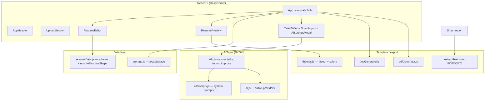
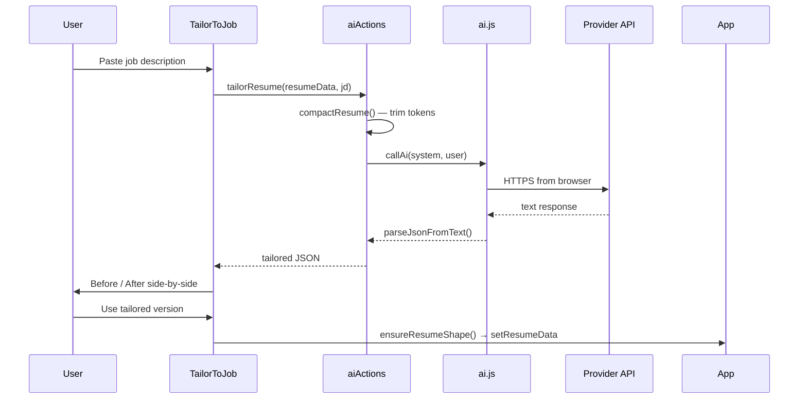

# Easy Customize — Resume Editor

A **backend-free**, **privacy-first** resume builder. JSON is the single source of truth. No accounts, no server-side storage — everything runs in the browser.

**Live demo:** [rakibulnahin.github.io/resume_editor](https://rakibulnahin.github.io/resume_editor)

---

## Core philosophy

| Principle | How it works |
|-----------|----------------|
| No sign-up | No auth, no accounts |
| User owns data | Resume JSON lives in `localStorage`; export JSON/DOCX/PDF anytime |
| BYOK AI | API keys stored only in the browser; AI calls go directly to the provider |
| Create once, reuse | Named versions + JSON export for multiple job applications |
| Mobile friendly | Responsive header, collapsible preview on small screens |

---

## Features

### Resume editing
- Form-based editor for all resume sections (experience, skills, projects, education, etc.)
- Live JSON panel — edit raw JSON or use the form; both stay in sync
- **My Resumes** — save/load multiple named versions in `localStorage`
- Autosave of the working draft (survives tab close)

### Smart Import (PDF / Word / text)
1. Upload `.pdf`, `.docx`, or `.txt` — text is extracted **in the browser** (mammoth + pdfjs-dist legacy build)
2. Review/edit extracted text
3. AI converts text → structured JSON (`parseResumeText`)
4. `ensureResumeShape()` normalizes output for the editor and preview

### AI assistant (Bring-Your-Own-Key)
Configure in **AI Settings** (Google Gemini recommended for speed):

| Feature | What it does |
|---------|----------------|
| **Tailor to JD** | Rewrites profile, bullets, and skill order for a job description — **before/after side-by-side review** before applying |
| **Improve bullet** | ✨ on experience/project bullets — Impact / Concise / Senior tone |
| **Improve profile** | ✨ on professional summary |
| **Smart Import** | Unstructured resume text → JSON schema |

Keys are never sent to any app server — only to your chosen provider from the browser.

### Templates & export
Four **layout** templates (not just colors):

| ID | Label | Layout |
|----|-------|--------|
| `classic` | Classic Professional | Single column, shaded section headers |
| `sidebar` | Modern Sidebar | Contact/skills in left column |
| `compact` | Compact One-Page | Dense single-page |
| `executive` | Executive Bold | Strong header band |

Exports: **JSON**, **DOCX** (docx package), **PDF** (jsPDF, selectable text).

---

## Architecture overview



### Request flow (AI tailor example)



---

## Project structure

```
src/
├── App.js                    # Root state, hydration, modals, layout grid
├── components/
│   ├── AppHeader.js          # Responsive toolbar + mobile menu
│   ├── AiSetupBanner.js      # First-time “set up AI” banner
│   ├── AiSettingsModal.js    # BYOK provider/key/model (z-index 200)
│   ├── AiImproveButton.js    # Inline ✨ bullet/profile rewriter
│   ├── ResumeEditor.js       # Main form (sections, arrays, nested paths)
│   ├── ResumePreview.js      # Live CV preview — 4 layout components
│   ├── ResumeVersions.js     # Named localStorage versions dropdown
│   ├── UploadSection.js      # JSON editor + Smart Import entry
│   ├── SmartImport.js        # PDF/DOCX → text → AI → JSON
│   ├── TailorToJob.js        # JD input → tailor → compare step
│   ├── TailorCompare.js      # Side-by-side before/after previews
│   ├── FormFields.js         # InputField, TextAreaField
│   ├── SectionCard.js        # Collapsible section wrapper
│   └── ui/
│       └── Modal.js          # Shared modal shell, scroll lock, z-index
├── utils/
│   ├── ai.js                 # Provider config, callAi, cancel, hasAiKey
│   ├── aiActions.js          # tailorResume, parseResumeText, improve*
│   ├── aiPrompts.js          # System prompts per feature
│   ├── resumeData.js         # emptyResume, ensureResumeShape, normalize
│   ├── storage.js            # Current resume + named versions
│   ├── extractText.js        # mammoth (DOCX), pdfjs legacy (PDF)
│   └── exportResume.js       # downloadJSON, exportToDocx, exportToPdf
└── template_generator/
    ├── themes.js             # Template definitions (layout + typography)
    ├── docGenerator.js       # DOCX per layout (incl. sidebar)
    └── pdfGenerator.js       # PDF per layout
```

---

## Resume JSON schema

The app uses a **flat** schema (not JSON Resume `basics`/`work`). AI output is coerced via `ensureResumeShape()`:

```json
{
  "name": "",
  "email": "",
  "phone": "",
  "address": "",
  "contacts": [{ "annotation": "LinkedIn", "link": "", "showAnnotation": true }],
  "profile": "",
  "experience": [{
    "company": "", "position": "", "address": "", "date": "",
    "description": ["bullet one", "bullet two"]
  }],
  "projects": [{ "name": "", "description": [""] }],
  "skills": [{ "type": "Programming", "value": ["JavaScript"] }],
  "education": [{ "school": "", "date": "", "details": "" }],
  "miscellaneous": [{ "type": "" }]
}
```

### `ensureResumeShape()` logic (`utils/resumeData.js`)

1. **`fromJsonResumeFormat()`** — if AI returns JSON Resume shape (`basics`, `work`), map to flat schema
2. **Merge with `emptyResume()`** — guarantee all keys and arrays exist
3. **Normalize items** — `description` → string arrays; map `highlights` → bullets; `employer` → `company`
4. **`normalizeResumeData()`** — skills `field` → `value` for legacy compatibility

---

## AI layer

### Providers (`utils/ai.js`)

| Provider | Browser-friendly | JSON mode | Notes |
|----------|------------------|-----------|-------|
| Google Gemini | ✅ | ✅ | **Recommended** — `gemini-2.0-flash` |
| OpenRouter | ✅ | ❌ | Use `openrouter/free`; prompt-based JSON only |
| Groq | ✅ | ❌ | Fast inference |
| Anthropic | ✅ | ❌ | Direct API |
| Custom | ✅ | ❌ | Ollama, LiteLLM, any OpenAI-compatible URL |

- Config key: `localStorage.resume_ai_config` → `{ provider, apiKey, model, baseUrl }`
- **`cancelActiveAiRequest()`** — shared `AbortController` for Cancel buttons
- **90s timeout** on long jobs (tailor, import)
- OpenRouter: **never** send `response_format: json_object` — free models hang

### System prompts (`utils/aiPrompts.js`)

Each feature has a dedicated system prompt:

| Export | Used by |
|--------|---------|
| `PROMPTS.improveBullet` | `improveBullet()` |
| `PROMPTS.improveProfile` | `improveProfile()` |
| `PROMPTS.tailorResume` | `tailorResume()` — immutable fields listed explicitly |
| `PROMPTS.parseResumeText` | `parseResumeText()` — flat schema, no invention |

`aiActions.js` builds user messages with schema + payload; `parseJsonFromText()` strips markdown fences from model output.

### Tailor flow (`components/TailorToJob.js`)

1. **input** — user pastes job description
2. **loading** — `tailorResume()` with snapshot of current resume
3. **compare** — `TailorCompare` shows two `ResumePreview` panels (Before / After)
4. User chooses **Use tailored**, **Keep original**, or **Edit job description**
5. On apply: `ensureResumeShape()` → `handleLoadVersion()` → scroll to preview

---

## Storage (`utils/storage.js`)

| Key | Purpose |
|-----|---------|
| `resumeData` | Current working resume (autosave) |
| `resume_editor_versions` | Array of `{ id, name, data, updatedAt }` |
| `resume_theme` | Selected template id |
| `resume_ai_config` | BYOK AI settings |
| `resume_ai_banner_dismissed` | User dismissed AI setup banner |

**Hydration guard in `App.js`:** autosave runs only after `loadCurrentResume()` completes — prevents empty state from overwriting a saved draft on mount.

One-time migration from legacy `sessionStorage.resumeData` → `localStorage`.

---

## UI / modal layering

| Layer | z-index | Components |
|-------|---------|------------|
| Mobile preview FAB | 30 | Edit/Preview toggle |
| Header | 40 | Sticky toolbar |
| Dropdowns | 50 | My Resumes panel |
| Feature modals | 100 | Tailor, Smart Import |
| **AI Settings** | **200** | Always on top |

When a feature modal calls `onNeedsKey()`, `App.js` **closes** Tailor/Smart Import first, then opens AI Settings — prevents hidden dialogs.

`components/ui/Modal.js`: backdrop click, Escape key, body scroll lock, responsive full-screen on mobile.

---

## Template & export pipeline

```
resumeData + themeId
       │
       ├─► ResumePreview.js  → React layouts (classic | sidebar | compact | executive)
       ├─► docGenerator.js   → DOCX (sidebar uses generateSidebarDoc)
       └─► pdfGenerator.js   → PDF via jsPDF
```

`getTheme(id)` resolves legacy ids (`classic-blue` → `classic`).

---

## Development

### Prerequisites
- Node.js 18+ (Node 24 LTS recommended)
- npm

### Run locally

```bash
npm install
npm start
```

Open **http://localhost:3000/resume_editor** (homepage path is required for HashRouter).

### Build

```bash
npm run build
```

Output goes to `build/` for GitHub Pages (`homepage` in `package.json`).

### AI setup (local testing)

1. Click **AI** → choose **Google Gemini**
2. Get a free key: [aistudio.google.com/apikey](https://aistudio.google.com/apikey)
3. Model: `gemini-2.0-flash`
4. **Test** → **Save**

---

## User workflow

### Step 1 — Build from scratch
1. Fill the form on the home page
2. Pick a template layout from the header dropdown
3. Download **DOCX**, **PDF**, and **JSON** (keep JSON for reuse)

### Step 2 — Reuse / customize
1. Upload JSON or use **Smart Import** on an existing resume file
2. Edit in form or JSON panel → **Apply to editor** if needed
3. Optional: **Tailor to JD** for a specific role (review before/after)
4. Save named versions in **My Resumes**
5. Export again

---

## Privacy

- No backend for resume data or AI keys
- AI requests: browser → your provider only
- PDF/DOCX parsing: entirely client-side
- You can clear AI config anytime in **AI Settings → Clear key**

---

## Contributing

This fork extends [rakibulnahin/resume_editor](https://github.com/rakibulnahin/resume_editor) with AI, layouts, PDF export, and UX improvements while keeping the original philosophy intact.

Branch: `feature/ai-and-ux-enhancements`

---

## Screenshots

### Home / editor


### JSON upload & customize


